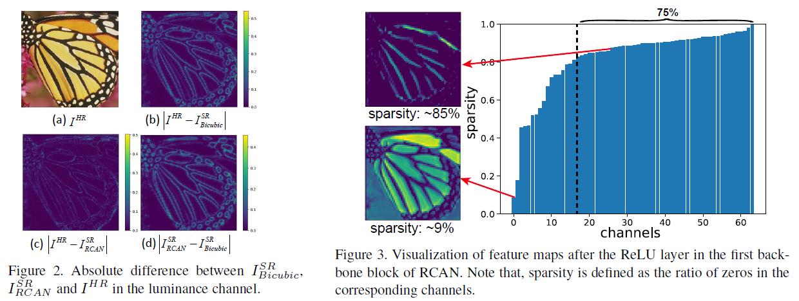
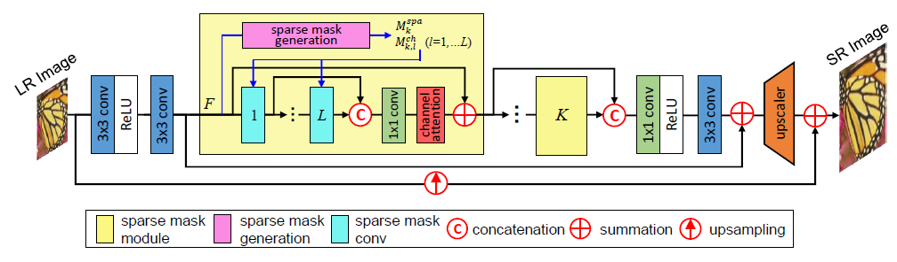
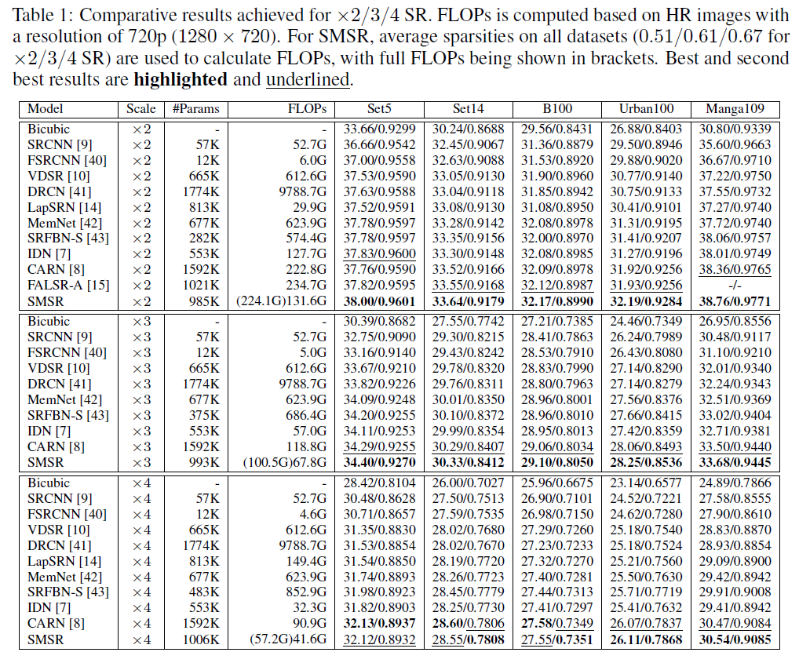
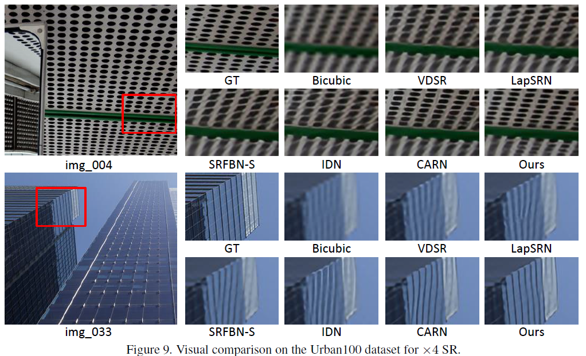
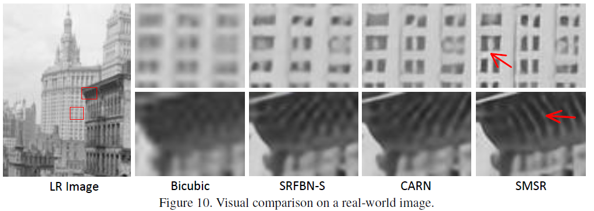
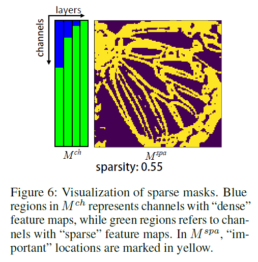
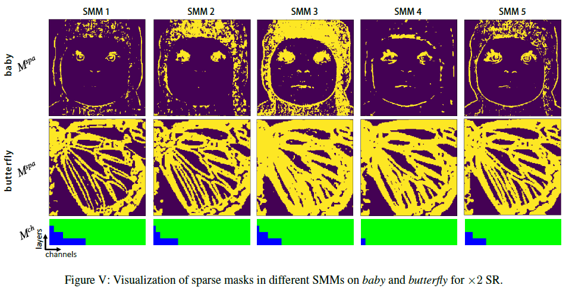

# SMSR
Pytorch implementation of "Exploring Sparsity in Image Super-Resolution for Efficient Inference", CVPR 2021

[[arXiv]](https://arxiv.org/pdf/2006.09603)


## Highlights

- Locate and skip redundant computation in SR networks at a fine-grained level for efficient inference.
- Maintain state-of-the-art performance with significant FLOPs reduction and a speedup on mobile devices.
- Efficient implementation of sparse convolution based on ***original Pytorch APIs*** for easier migration and deployment.

## Motivation
<p align="center">  </p>


## Network Architecture
<p align="center">  </p>


<p align="center">  </p>


## Implementation of Sparse Convolution
For easier migration and deployment, we use an efficient implementation of sparse convolution based on original Pytorch APIs rather than the commonly applied CUDA-based implementation. Specifically, sparse features are first extracted from the input, as shown in the following figure. Then, matrix multiplication is executed to produce the output features.

</div>


## Requirements
- Python 3.6
- PyTorch == 1.1.0
- numpy
- skimage
- imageio
- matplotlib
- cv2


## Train
### 1. Prepare training data 

1.1 Download DIV2K training data (800 training + 100 validtion images) from [DIV2K dataset](https://data.vision.ee.ethz.ch/cvl/DIV2K/) or [SNU_CVLab](https://cv.snu.ac.kr/research/EDSR/DIV2K.tar).

1.2 Specify '--dir_data' based on the HR and LR images path. In option.py, '--ext' is set as 'sep_reset', which first convert .png to .npy. If all the training images (.png) are converted to .npy files, then set '--ext sep' to skip converting files.

For more informaiton, please refer to [EDSR(PyTorch)](https://github.com/thstkdgus35/EDSR-PyTorch).

### 2. Begin to train
```bash
python main.py --model SMSR --save SMSR_X2 --scale 2 --patch_size 96 --batch_size 16
```

## Test
### 1. Prepare test data 
Download [benchmark datasets](https://github.com/xinntao/BasicSR/blob/a19aac61b277f64be050cef7fe578a121d944a0e/docs/Datasets.md) (e.g., Set5, Set14 and other test sets) and prepare HR/LR images in `testsets/benchmark` following the example of `testsets/benchmark/Set5`.


### 2. Demo
```bash
python main.py --dir_data testsets --data_test Set5 --scale 2 --model SMSR --save SMSR_X2 --pre_train experiment/SMSR_X2/model/model_1000.pt --test_only --save_results
```


## Results

<p align="center">  </p>

<p align="center">  </p>

<p align="center">  </p>


## Visualization of Sparse Masks

<p align="center">  </p>

<p align="center">  </p>


## Citation
```
@InProceedings{Wang2020Exploring,
  author    = {Wang, Longguang and Dong, Xiaoyu and Wang, Yingqian and Ying, Xinyi and Lin, Zaiping and An, Wei and Guo, Yulan},
  title     = {Exploring Sparsity in Image Super-Resolution for Efficient Inference},
  booktitle = {CVPR},
  year      = {2021},
}
```

## Acknowledgements
This code is built on [EDSR (PyTorch)](https://github.com/thstkdgus35/EDSR-PyTorch). We thank the authors for sharing the codes.

